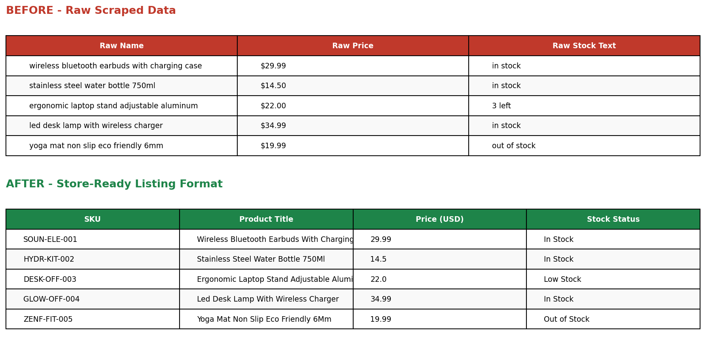

# Product Listing Formatting — E-commerce Catalog

## Objective
Take raw, inconsistent product data (as typically pulled from a supplier site or scraper) and convert it into a store-ready listing template compatible with platforms like Shopify, WooCommerce, and Amazon Seller Central.

## Problems in Raw Data
- Lowercase, unstructured product names
- Prices as text strings (`$29.99`) instead of numeric values
- Inconsistent stock text (`in stock`, `3 left`, `out of stock`) with no structured quantity
- No SKU / unique product identifiers
- Raw, unpolished descriptions

## What Was Done
1. Generated unique SKUs following a `BRAND-CATEGORY-###` convention
2. Converted product names to proper Title Case
3. Parsed prices into clean numeric values
4. Standardized stock status into three clear states (In Stock / Low Stock / Out of Stock) with quantity extracted where available
5. Polished raw keyword-style descriptions into readable sentences
6. Organized everything into the column structure store platforms expect for bulk import

## Tools
Python, pandas, regex

## Files
- `raw_scraped_products.csv` — raw input data
- `formatted_product_listings.csv` — final store-ready listing sheet
- `before_after_comparison.png` — visual comparison
- `format_listings.py` — the formatting script
## Image

