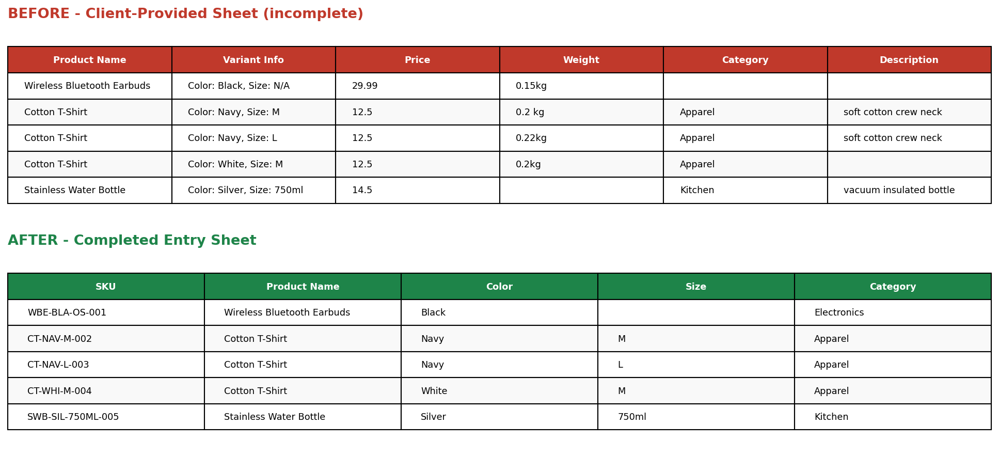

# E-commerce Data Entry — Product Catalog Completion

## Objective
Take a partially-filled client product sheet — the kind that arrives with variant details crammed into one column, missing categories, and gaps in descriptions — and turn it into a complete, structured catalog entry ready for store upload.

## Problems in the Client Sheet
- Variant info (color + size) combined into a single free-text column
- Missing product categories for 2 items
- Missing descriptions for 3 items
- Inconsistent weight formatting (`0.2 kg` vs `0.2kg`) and one missing weight value
- No SKU / unique identifiers for inventory tracking

## What Was Done
1. Split combined variant text into separate **Color** and **Size** columns
2. Generated unique SKUs following a `PRODUCT-COLOR-SIZE-###` convention
3. Filled missing categories using product-type logic
4. Filled missing descriptions with concise, on-brand copy matching the existing tone
5. Standardized weight formatting to clean numeric kg values
6. **Flagged the one row with no weight data as "NEEDS INPUT"** rather than guessing — accurate data entry means knowing what NOT to fill in

## Tools
Python, pandas, regex

## Files
- `client_provided_sheet.csv` — original incomplete sheet (input)
- `completed_entry_sheet.csv` — final completed catalog sheet (output)
- `before_after_comparison.png` — visual comparison
- `process_entry.py` — the processing script
## Image

