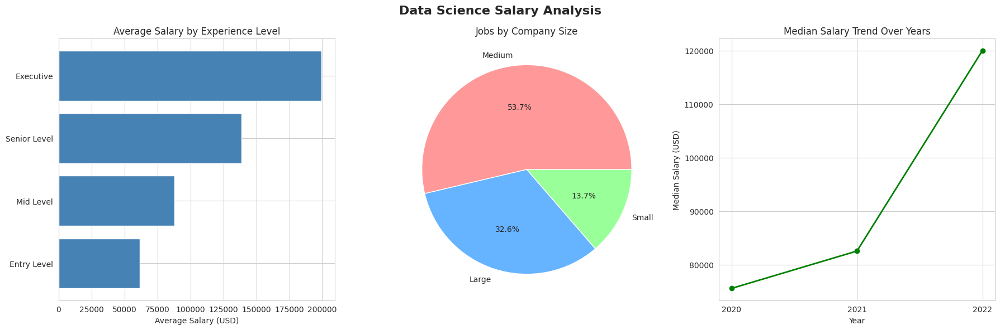

# Data Science Salary Analysis 📊

## Overview
This project analyzes 607 data science job listings from 2020-2022,
uncovering key trends in salaries, experience levels, and company sizes.

## Key Insights
- Executive roles earn an average of $199,392 USD
- Medium companies dominate the market at 53.7% of all jobs
- Median salaries grew 59% from $75,544 in 2020 to $120,000 in 2022

## Tools Used
- Python
- Pandas
- Matplotlib
- Seaborn

## Steps Performed
1. Loaded and explored raw dataset
2. Checked for missing values
3. Decoded abbreviated labels to human readable format
4. Generated visualizations
5. Extracted key business insights

## Dataset
Source: Kaggle - Data Science Job Salaries

## Visualization

