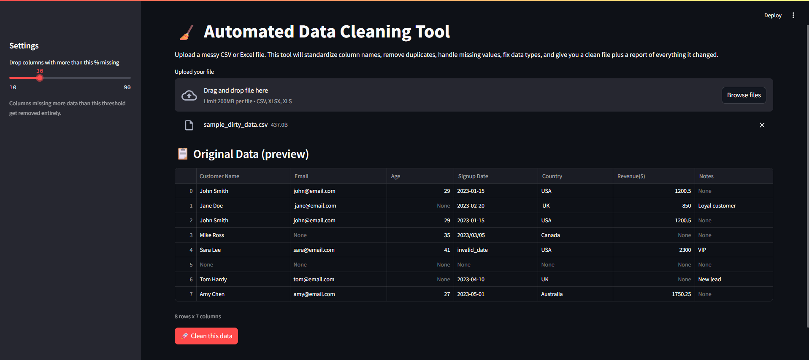
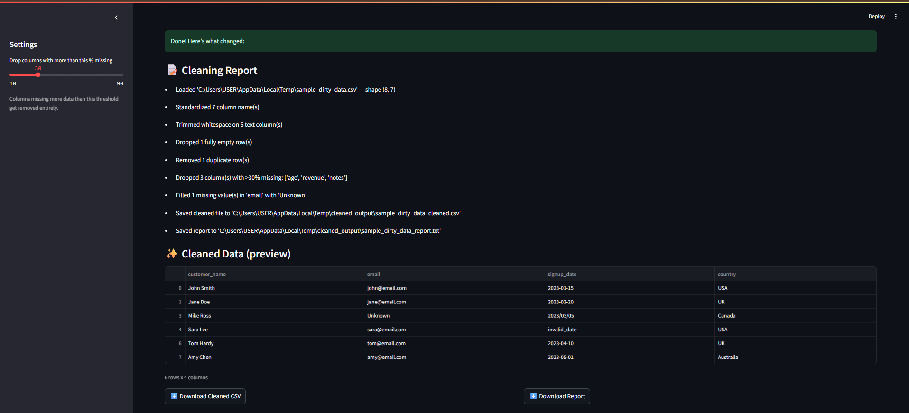

# 🧹 Automated Data Cleaning Pipeline


A Python-based data cleaning tool with a Streamlit web interface. Upload a messy CSV or Excel file and get back a cleaned, analysis-ready dataset — plus a full report of every change made.

---

## 🚀 What It Does

The `DataCleaner` class automatically:
- ✅ Standardizes column names
- ✅ Trims whitespace from text columns
- ✅ Drops fully empty rows
- ✅ Removes duplicate rows
- ✅ Fills missing values (median for numeric fields, "Unknown" for categorical/text fields)
- ✅ Generates a detailed cleaning report showing exactly what changed and why

---

## 📊 Example Output

Given a sample file with 8 rows and 7 columns, the pipeline:

| Step | Result |
|------|--------|
| Column names standardized | 7 columns |
| Whitespace trimmed | 5 text columns |
| Empty rows dropped | 1 row |
| Duplicate rows removed | 1 row |
| Missing values filled | `email`, `age`, `revenue`, `notes` |
| **Final shape** | **6 rows × 7 columns** |

Full before/after files and the generated report are included in this folder.

---

## 🖥️ How to Use

1. Run the Streamlit app:
```bash
   streamlit run app.py
```
2. Upload your CSV or Excel file through the browser
3. Download the cleaned version, along with a full report of what was changed

---

### Screenshots

**Upload & Preview**


**Cleaning Report & Results**


---

## 🛠️ Tech Stack
`Python` · `Pandas` · `Streamlit`

## 📁 Files
- `app.py` — Streamlit web interface
- `clean_pipeline.py` — core `DataCleaner` class
- `sample_dirty_data.xls` — example input
- `sample_cleaned_data.xls` — example output
- `sample_cleaning_report.txt` — generated report
- `requirements.txt` — dependencies
