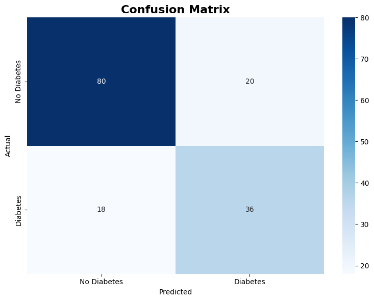
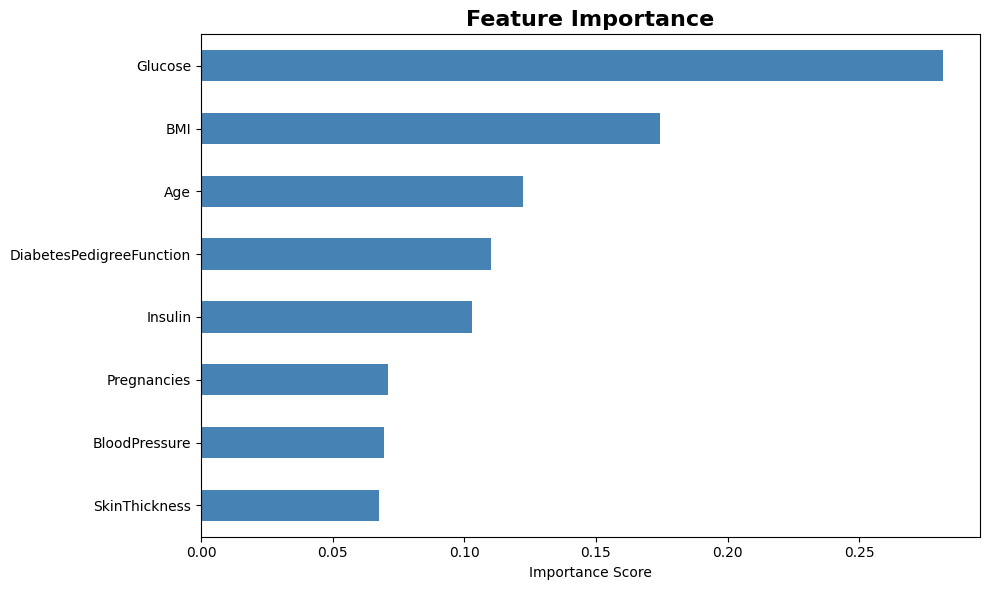

# Diabetes Prediction using Machine Learning

A supervised machine learning pipeline that predicts diabetes risk from diagnostic health measurements, using the Pima Indians Diabetes dataset.

## 📊 Dataset

- **Source:** [Pima Indians Diabetes Database (Kaggle)](https://www.kaggle.com/datasets/uciml/pima-indians-diabetes-database)
- **Size:** 768 patient records
- **Features:** Glucose, BMI, Age, Blood Pressure, Insulin, Skin Thickness, Diabetes Pedigree Function, Pregnancies
- **Target:** Binary classification — Diabetes / No Diabetes

## 🛠️ Approach

1. **Data Cleaning** — handled invalid zero-values in medical fields (e.g. Glucose, BMI) using median imputation
2. **Train/Test Split** — stratified split to preserve class distribution across train and test sets
3. **Class Imbalance Handling** — used `class_weight='balanced'` in the Random Forest classifier so the model doesn't just default to predicting the majority class
4. **Model** — Random Forest Classifier
5. **Evaluation** — confusion matrix, precision/recall/F1 per class, and feature importance analysis

## 📈 Results

**Model Accuracy: 75.32%**

| Class        | Precision | Recall | F1-score | Support |
|--------------|-----------|--------|----------|---------|
| No Diabetes  | 0.82      | 0.80   | 0.81     | 100     |
| Diabetes     | 0.64      | 0.67   | 0.65     | 54      |
| **Accuracy** |           |        | **0.75** | 154     |
| Macro avg    | 0.73      | 0.73   | 0.73     | 154     |
| Weighted avg | 0.76      | 0.75   | 0.75     | 154     |



### Feature Importance



| Rank | Feature  | Importance |
|------|----------|------------|
| 1    | Glucose  | 0.28       |
| 2    | BMI      | 0.17       |
| 3    | Age      | 0.12       |

**Clinical Insight:** High glucose levels emerged as the strongest predictor of diabetes — consistent with established medical literature, which lends confidence to the model beyond just the accuracy numbers.

## 🚀 How to Run

```bash
pip install -r requirements.txt
jupyter notebook diabetes_prediction.ipynb
```

## 🧰 Tech Stack

- Python, pandas, scikit-learn, matplotlib/seaborn

## 📁 Files

- `diabetes_prediction.ipynb` — full pipeline: cleaning, training, evaluation
- `diabetes.csv` — dataset
- `images/` — confusion matrix and feature importance visualizations
