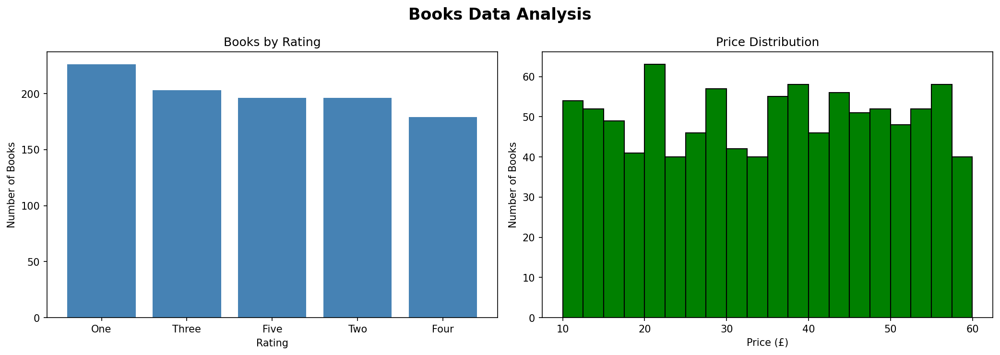

# Project 2 - Web Scraping: Books Data

## Overview
Scraped 1000 books across 50 pages from books.toscrape.com
using Python, Requests, and BeautifulSoup.

## Key Insights
- Total books scraped: 1000
- Average price: £35.07
- Most expensive book: £59.99
- Cheapest book: £10.00
- Most common rating: One

## Tools Used
- Python
- Requests
- BeautifulSoup
- Pandas
- Matplotlib

## Visualization

