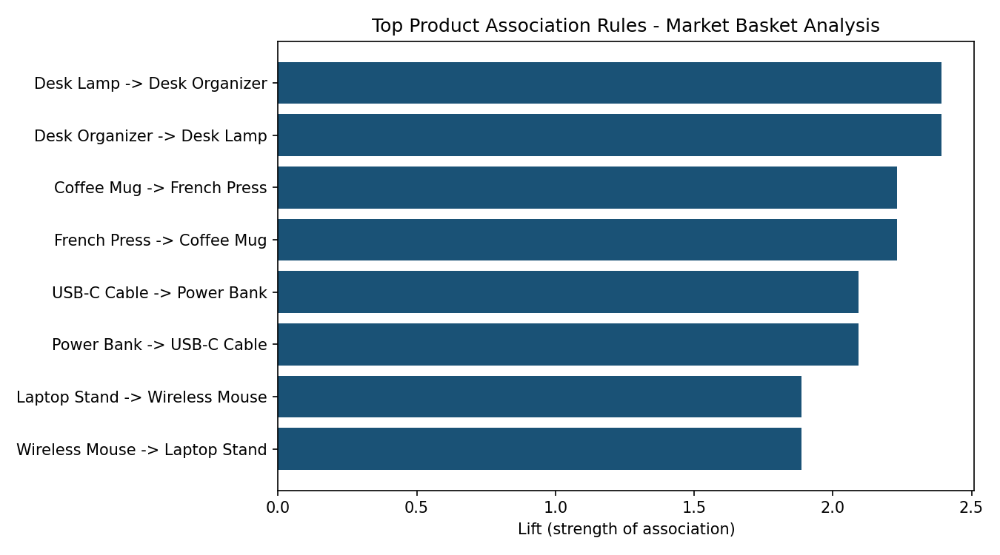

# Market Basket Analysis — Data Mining Project

## Objective
Discover hidden purchasing patterns in e-commerce transaction data to answer:
*"When a customer buys product A, what else are they likely to buy?"*
This kind of analysis powers real "Frequently Bought Together" and recommendation features on e-commerce platforms.

## Method
- **Technique:** Association Rule Mining (Apriori algorithm)
- **Tools:** Python, pandas, mlxtend
- **Dataset:** 482 simulated transaction records across 17 SKUs in electronics, kitchen, and office categories
- **Metrics used:**
  - **Support** — how frequently the itemset appears in all transactions
  - **Confidence** — how often the consequent is bought given the antecedent
  - **Lift** — how much more likely the consequent is bought with the antecedent vs. by chance (lift > 1 = meaningful association)

## Key Findings
| If customer buys | They're also likely to buy | Confidence | Lift |
|---|---|---|---|
| Pen Set | Notebook | 86.8% | 1.70 |
| Screen Protector | Phone Case | 86.8% | 1.65 |
| Coffee Mug | French Press | 72.2% | 2.23 |
| Laptop Stand | Wireless Mouse | 79.5% | 1.89 |
| Power Bank | USB-C Cable | 82.1% | 2.09 |

## Business Application
These rules can directly power:
- Product recommendation widgets ("Customers who bought this also bought...")
- Bundle/discount offers to increase average order value
- Smarter inventory placement (physical or category pages)

## Files
- `raw_transactions.csv` — raw order data (input)
- `association_rules_clean.csv` — full output of mined rules
- `top_rules_chart.png` — visualization of strongest associations
## Image

